# Хэш-таблица

## Цель проекта: исследовать оптимизации хэш-таблицы с помощью профилировщиков и других функций замера производительности

## Использовавшиеся инструменты
Perf, Hotspot, Godbolt, Gnuplot

## Краткое описание хода работы
Сначала я написали начальную базовую версию без оптимизаций. C помощью профилировщика Perf и визуализации Hotspot проанализируем программу и найдем функции, которые выполняются чаще и дольше всего. Их в первую очередь и будем оптимизировать. После оптимизации опять проведем анализ и высчитаем прирост. Для итогового прироста посчитаем условный "КПД" η = Прирост / Количество ассемблерных строк. Это небольшой стимул писать оптимизации как можно меньше на ассемблере для избежания потери читаемости кода.

# Выполнение
Для исследования производительности я взял текст И.А. Гончарова "Обломов" на английском языке. Элементами хэш-таблицы являются двусвязные списки, в которых лежит буффер по 32 байта, содержащий слова. Размер хэш-таблицы брался такой, чтобы в каждом бакете (списке) лежало примерно 20 слов. Это нужно для исследования оптимизаций функции поиска. Перед работой с хэщ-функцией я отформатировал текст так, чтоб каждое слово занимало 32 байта (т.е. дополнялось нулевыми байтами, это делалось для будущих оптимизаций), убрав при это знаки препинания (дефисы являются частью слова). В данном тексте всего 62393, из которых уникальных 8085.

## Способ замера производительности
Для замера производительности мы будем испрользовать функцию rdtscp. Подробнее о ней смотри в отчете к проекту [Множество Мандельброта](https://github.com/Raptor-X102/Mandelbrot-set). С помощью makefile производится подряд несколько запусков, в каждом из которых по 200 раз ищутся все слова текста для каждой версии, все тестовые данные записываются в формате csv для дальнейшей обработки в exel.

## Версия 1. Базовая
Для базовой версии я выбрал хэш-функцию crc32. Именно ее получится хорошо в дальнейшем оптимизировать с помощью интринсиков.

<details>
<summary>Показать хэш-функцию</summary>

```c
uint64_t Hash_func_crc32_basic(const void* buffer_start, const void* buffer_end) {

    const uint8_t* start = (const uint8_t*)buffer_start;
    const uint8_t* end = (const uint8_t*)buffer_end;
    size_t len = end - start;

    const uint8_t* bytes = start;
    uint32_t crc = Crc32_Init_Value; // Crc32_Init_Value = 0xFFFFFFFF

    for (size_t i = 0; i < len; i++) {

        uint8_t index = (uint8_t)((crc ^ bytes[i]) & 0xFF);
        crc = (crc >> 8) ^ crc32_table[index];
    }

    return crc ^ Crc32_Init_Value;
}
```
</details>

Поиск слов в бакете происходит путем перебора всех индексов.

<details>
<summary>Показать функцию поиска</summary>

```c
int64_t Hash_table_find(Hash_table_t* hash_table, void* element, int element_size, Compare_func_t compare_func) {

    size_t element_hash = hash_table->hash_func(element, (char*)element+element_size);
    int64_t list_index = element_hash % hash_table->table_size;
    List* list_ptr = &hash_table->lists_array[list_index];

    return List_find_element_c(list_ptr, element, element_size, compare_func);
}

int64_t List_find_element_c(List* list, void* element, int size, Compare_func_t compare_func) {

    int64_t index = 0;
    do {

        List_data tmp_list_el = list->list_data[index];
        if(compare_func(&tmp_list_el.element, element, size) == Elements_equal)
            return index;

        index = tmp_list_el.next;

    } while(index != 0);

    return Not_found_value;
}
```
</details>

Функция сравнения Compare_func_t compare_func в данном случае выступает обычная strcmp

<details>
<summary>Показать compare_func</summary>

```c
int Compare_strings(void* element1, void* element2, int el_size) {

    CHECK_ELEMENTS(element1, element2)
    return strcmp((const char*)element1, (const char*)element2) - 1;
}
```
</details>

### Анализ программы

С помощью Gnuplot построим гистограмму распределения слов по бакетам
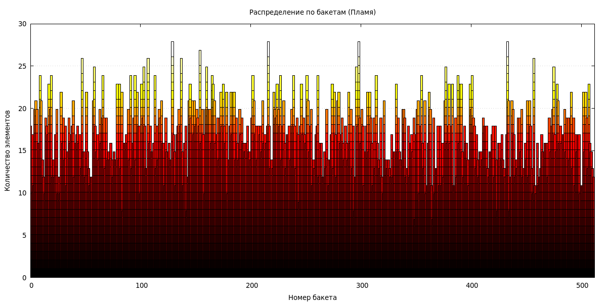
Как мы видим, слова расположены довольно равномерно.
Теперь с помощью Perf и Hotspot проанализируем получившуюся версию. Мы будем искать самую "горячую" функцию в Flame graph и самые верхние функции в Caller/Callee, т.к. именно там указано процентное соотношение тиков.
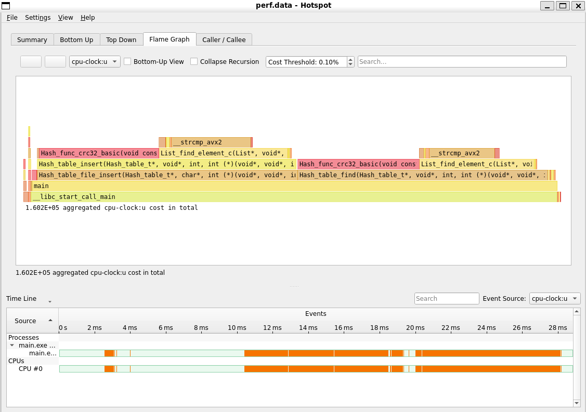
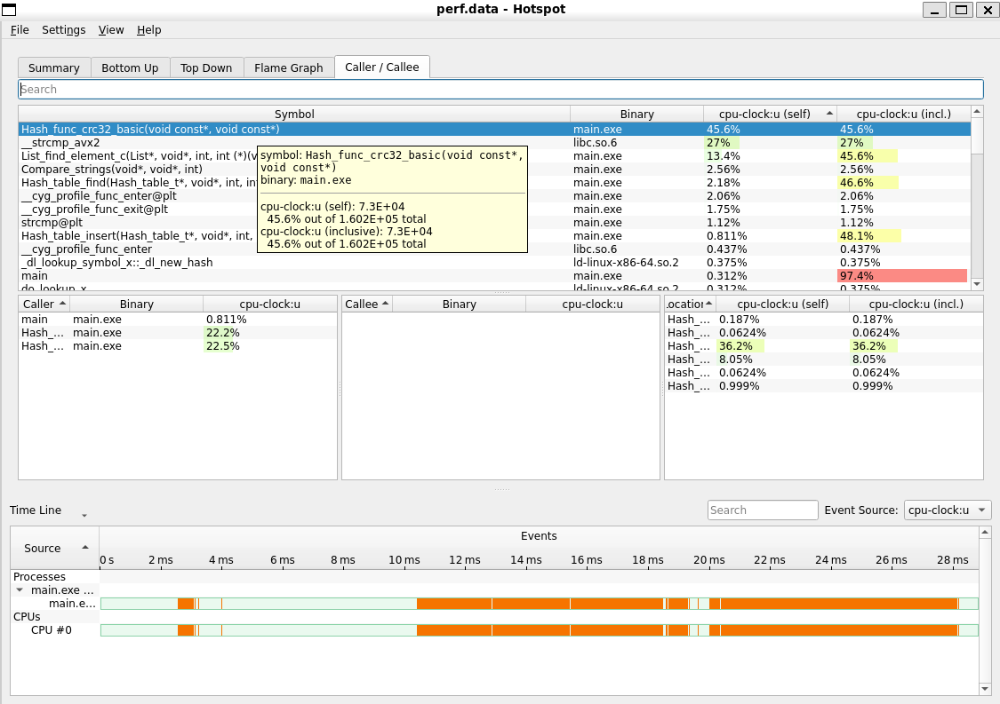

Как мы видим, чаще и дольше всего выполняется хэш-функция. Именно с нее мы и начнем оптимизировать программу.

## Версия 2. Хэш-функция на интринсиках

Мы неспроста выбрали именно crc32. Именно для этой хэш-функции существует интринсик _mm_crc32_u64. Здесь хэшируются ровно 32 байта, чтобы не создавать цикл, который замедлит функцию. Однако выровненные по 32 слова нужны и для следующей оптимизации.

<details>
<summary>Показать хэш-функцию</summary>

```c
uint64_t Hash_func_crc32_intrinsics(const void * buffer_start, const void * buffer_end) {

    uint64_t crc = Crc32_Init_Value;
    __m256i vec = _mm256_load_si256((const __m256i*)buffer_start);

    crc = _mm_crc32_u64(crc, _mm256_extract_epi64(vec, 0));
    crc = _mm_crc32_u64(crc, _mm256_extract_epi64(vec, 1));
    crc = _mm_crc32_u64(crc, _mm256_extract_epi64(vec, 2));
    crc = _mm_crc32_u64(crc, _mm256_extract_epi64(vec, 3));

    return crc ^ Crc32_Init_Value;
}
```
</details>

### Анализ программы

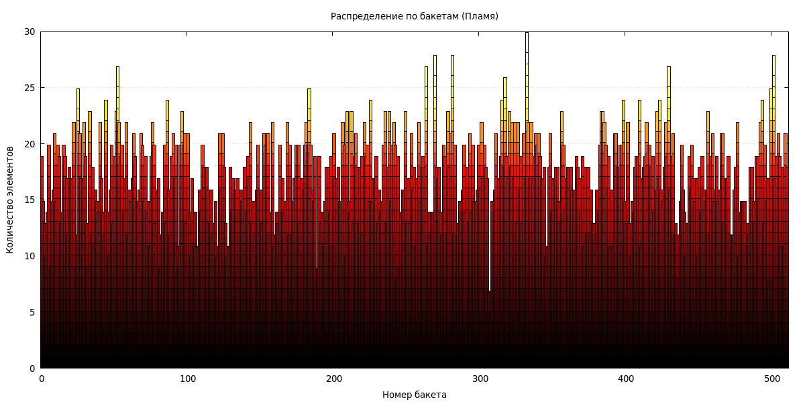
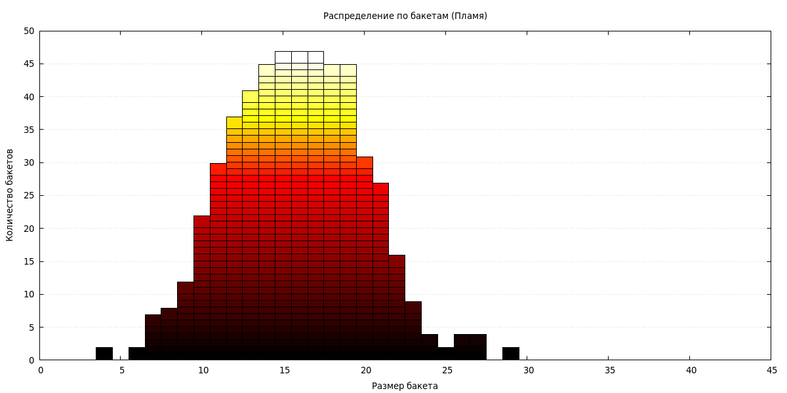
Версия хэш-функции на интринсиках также равномерно распределяет слова по бакетам.

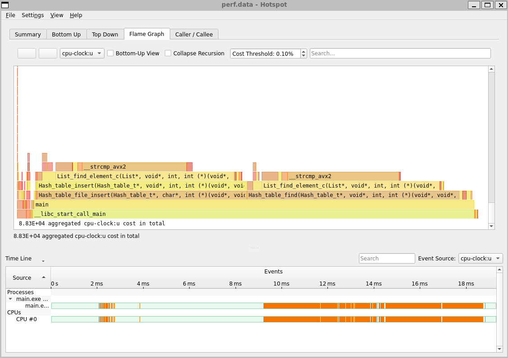
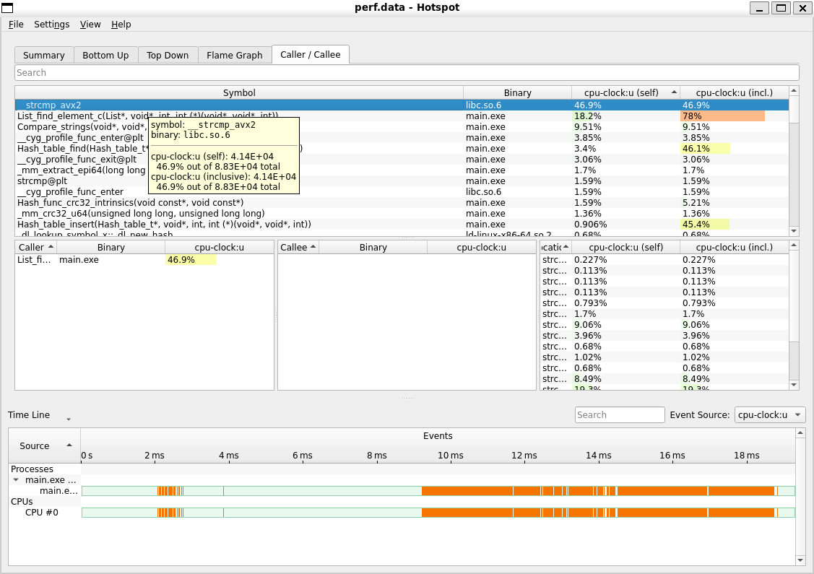

Как мы видим, теперь хэш-функция работает намного быстрее. Теперь hotspot указывает на то, что следующая функция для оптимизации - strcmp.


## Версия 3. Оптимизированная strcmp

Поскольку strcmp - универсальная функция, она сильно ограничена в скорости. Несмотря на то, что в ней используюстя AVX2 регистры, ей приходится обрабатывать "хвост" строки. Поэтому предлагается избавиться от этой проблемы, передавая в качестве элемента строку размером 32 байта. Именно поэтому мы разбивали слова, дополняя их нулевыми символами. Теперь с помощью ymm регистров мы сможем быстро сравнивать наши слова.

P.S. В нашем тексте все слова умещаются в 32 байта, а в других текстах даже если и встречаются, то очень редко. Поэтому данное решение не сильно ограничивает использование хэш-таблицы.

Реализацию данной функции мы выполним отдельным asm-модулем.
<details>
<summary>Показать функцию Strcmp_256</summary>

```nasm
BITS 64
global main
global Strcmp_256
extern  ExitProcess

section .text
;------------------------------------------------------------------------------
; Strcmp 256 bits
; Entry: rdi, rsi - strings
; Exit: eax - compare mask
; Destr: eax, ymm0, ymm1, ymm2
;------------------------------------------------------------------------------
Strcmp_256:

    vmovdqu ymm0, [rdi]         ; загрузить первую строчку в ymm0
    vpcmpeqb ymm2, ymm0, [rsi]  ; сравнить 32 байта в ymm0 и во второй строчке
    vpmovmskb eax, ymm2         ; байты результата сравнения перевести в биты eax
    vzeroupper                  ; занулить старшие байты ymm регистров (нужно для ускорения)
    ret
;------------------------------------------------------------------------------
```
</details>

### Анализ программы

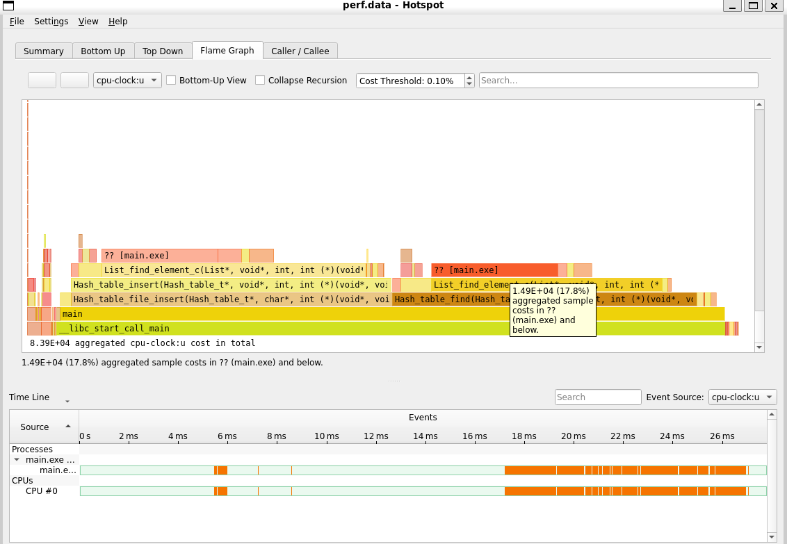
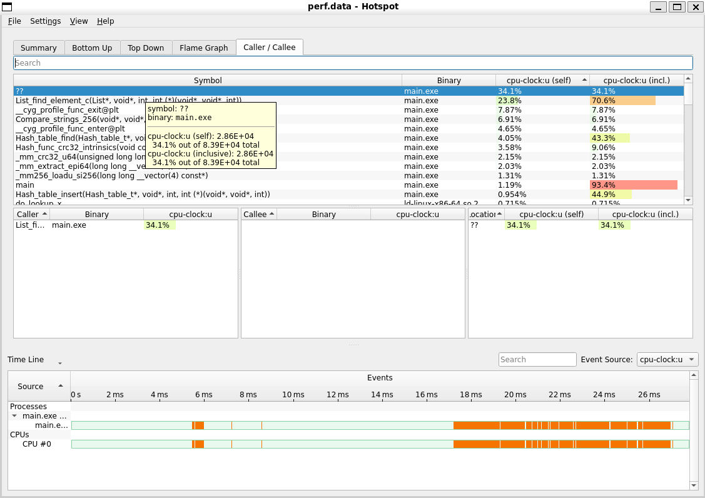

В hotspot имена функций, написанных на ассемблере отдельно, не отображаются из-за того, что у них нет пролога (push rbp, mov rbp, rsp, sub rsp ...). Однако по вызывающей функции мы можем судить, что это именно наша оптимизированная strcmp_256. По количеству тиком можно увидеть, что функция работает быстрее примерно в 1,4 раза. Поскольку добавление пролога и эпилога увеличит размер функции в 3 раза, то это сильно снизит прирост производительности. Поэтому придется отказаться от этого.

## Версия 4. Оптимизированный остаток от деления

Далее я решил оптимизировать остаток от деления, который нужен для определения номера бакета в функции поиска. В исходном коде эта операция происходит за счет инструкции div, которая сама по себе является довольно медленной.
<details>
<summary>Показать функцию поиска</summary>

```c
int64_t Hash_table_find(Hash_table_t* hash_table, void* element, int element_size, Compare_func_t compare_func) {

    size_t element_hash = hash_table->hash_func(element, (char*)element+element_size);
    int64_t list_index = element_hash % hash_table->table_size;         // операция взятия остатка от деления
    List* list_ptr = &hash_table->lists_array[list_index];

    return List_find_element_c(list_ptr, element, element_size, compare_func);
}
```
</details>

Параметры компиляции через Godbolt:
x86-64 gcc 14.2, -O3
<details>
<summary>Показать ассемблерный вариант, сгенерированный Godbolt</summary>

```nasm
Hash_table_find_c(Hash_table_t*, void*, int, int (*)(void*, void*, int)):
        push    r13
        mov     r13, rcx
        push    r12
        push    rbp
        mov     rbp, rsi
        movsx   rsi, edx
        push    rbx
        mov     rbx, rdi
        mov     r12, rsi
        mov     rdi, rbp
        add     rsi, rbp
        sub     rsp, 8
        call    [QWORD PTR [rbx+16]]
        xor     edx, edx
        mov     rdi, QWORD PTR [rbx]
        mov     rcx, r13
        div     QWORD PTR [rbx+8]       ; Инструкция div, записывающая результат деления в rax, остаток в rdx
        add     rsp, 8
        mov     rsi, rbp
        pop     rbx
        pop     rbp
        sal     rdx, 5
        add     rdi, rdx
        mov     edx, r12d
        pop     r12
        pop     r13
        jmp     List_find_element_c(List*, void*, int, int (*)(void*, void*, int))
```
</details>

Известно, что остаток от деления на степень двойки можно вычислить с помощью побитового И, т.к. a % 2^N <=> a & (2^N - 1). Для этого нужно потребовать, чтобы размер хэш-таблицы был равен степени двойки. Для нашего текста с учетом того, чтобы в каждом бакете было примерно 20 слов, размер будет 512 бакетов. С помощью ассемблерной вставки оптимизируем функцию поиска

<details>
<summary>Показать функцию поиска</summary>

```c
int64_t Hash_table_find_mod_div(Hash_table_t* hash_table, void* element, int element_size, Compare_func_t compare_func) {

    size_t element_hash = hash_table->hash_func(element, (char*)element + element_size);
    int64_t mask = hash_table->table_size - 1;

    __asm__ __volatile__ (
        "and %[mask], %[hash]\n\t"
        : [hash] "+r" (element_hash)
        : [mask] "r" (mask)
    );

    List* list_ptr = &hash_table->lists_array[element_hash];

    return List_find_element_c(list_ptr, element, element_size, compare_func);
}
```
</details>

### Анализ программы

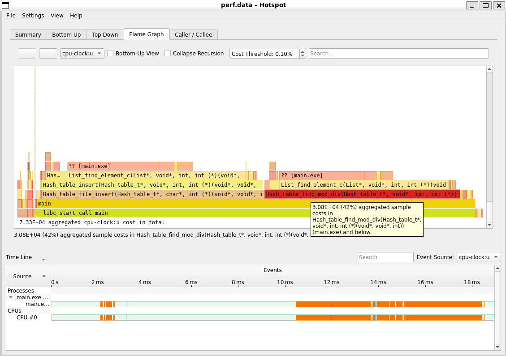
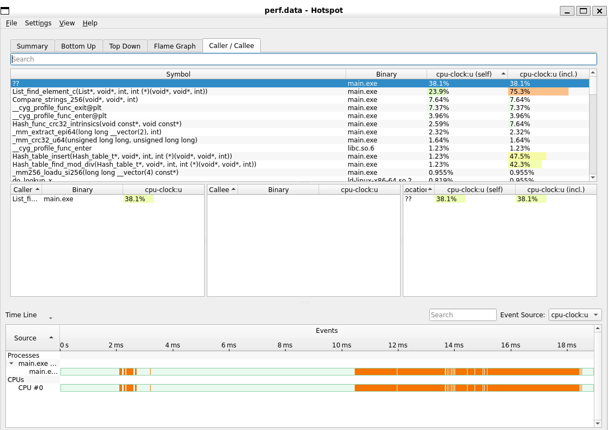

Из полученных данных видно, что программа действительно ускорилась, но уже не так сильно, как до этого, поскольку эта оптимизация не такая масштабная.

## Результаты оптимизаций

Теперь по полученным данным рассчитаем прирост, КПД и погрешность наших измерений.

Экспериментальные значения
|             	| Version 1 	| Version 2 	| Version 3 	| Version 4 	|
|-------------	|-----------	|-----------	|-----------	|-----------	|
| Ticks, 10^3 	| 28,1      	| 9,57      	| 7,81      	| 7,41      	|
| Time, ms    	| 8,43      	| 3,19      	| 2,6       	| 2,47      	|
| Accuracy, % 	| 0,12      	| 0,21      	| 0,35      	| 0,26      	|

Прирост относительно предыдущей версии
| Version 2 	| Version 3 	| Version 4 	|
|-----------	|-----------	|-----------	|
| 2,93      	| 1,23      	| 1,05      	|

Итоговый прирост последней версии относительно базовай составил 3,79.
Теперь посчитаем КПД. Всего на ассемблере, не считая комментариев и пустых строчек, написано 12 строк (1 в ассемблерной вставке, 11 с учетом загаловка asm-файла в функции strcmp_256). Итого КПД η = 3,79 / 12 = 31,6 %.

# Наложенные ограничения для большей производительности
Чтобы ускорить программу, нам пришлось прибегнуть к некоторой потере универсальности хэш-таблицы.
1. Длина слов меньше 32 байт, все слова выровнены. Это было необходимо как для быстроты хэш-функции, так и для strcmp.
2. Размер хэш-таблицы - степень двойки. Это необходимо для правильного вычисления остатка от деления с помощью побитовой операции.

# Выводы
Были написаны 4 версии программы, сделаны 3 оптимизации, включающие в себя использование интринсиков, ассемблерных вставов, вынесение оптимизированной на ассемблере функции в отдельный модуль. Исследован прирост производительности в зависимости от оптимизации. Построены гистрограммы распределения элементов по бакетам хэш-таблицы. Построены сравнительные таблицы

# Характеристики
| Устройство               	| Huawei Matebook D 16                                                	|
|:-------------------------:|:---------------------------------------------------------------------:|
| OS                       	| Windows 11 Домашняя, WSL 2 Debian                                   	|
| CPU                      	| 13th Gen Intel(R) Core(TM) i9-13900H                                	|
| Объем оперативной памяти 	| 16,0 ГБ                                                             	|
| Тип системы              	| 64-разрядная операционная система, процессор x64                    	|
| Компилятор               	| x86_64-w64-mingw32-g++.exe<br>(Rev3, Built by MSYS2 project) 14.2.0 	|
